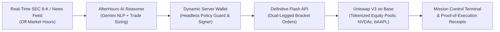

# ⚡ AFTERHOURS
### Autonomous 24/7 Off-Market Corporate Event & Breakout Engine for Tokenized Equities on Base

> Built for **Runtime NYC Agent Week 2026** (September 13–19, 2026)  
> Track Entries: **Bankr Grand Prize** • **Definitive Flash** • **Dynamic** • **Uniswap**

---

## 🎯 The Problem: The 128-Hour TradFi Blind Spot
Traditional US equity exchanges (NYSE & Nasdaq) trade for just 6.5 hours a day (9:30 AM – 4:00 PM Eastern Time), Monday through Friday. They are **completely closed nights and all weekend**—leaving **128 hours out of every 168 hours in a week completely dark**.

Yet corporate catalysts don't wait for Wall Street's opening bell:
- **Major Earnings Surprises** drop after 4:00 PM EST.
- **Material 8-K Regulatory Disclosures** land over the weekend.
- **Macro Announcements & M&A Leaks** break outside regular market hours.

During these windows, traditional retail traders are trapped and locked out. Meanwhile, **onchain tokenized equities on Base (Coinbase Wrapped NVDAc, Backed bAAPL, bTSLA, bCOIN) trade 24/7 on Uniswap pools**.

---

## ⚡ The Solution: AfterHours
**AfterHours** is an autonomous AI trading agent that bridges real-world off-market catalysts with 24/7 onchain liquidity:



1. **Catalyst Detection:** Ingests SEC EDGAR 8-K/10-Q filings, corporate earnings announcements, and breaking wires outside NYSE hours.
2. **AI Reasoning & Sizing:** Evaluates fundamental surprise delta and sentiment score; verifies TradFi market closure.
3. **Autonomous Dynamic Signing:** Uses a **Dynamic Server Wallet** to programmatically authenticate and authorize transactions without requiring manual user popup confirmations, strictly bound by a spending envelope.
4. **Definitive Flash Bracket Orders:** Dispatches dual-legged bracket orders (`POST /v1/orders/bracket`) that pair an entry limit with an automated **Take-Profit target (+4% to +8.5%)** and **Stop-Loss floor (-1.85%)**.
5. **Uniswap Base Liquidity:** Executes against high-depth Uniswap V3 tokenized stock pools on Base L2 with sub-cent gas fees.

---

## 🏆 Hackathon Sponsor Track Compliance

### 1. Bankr Grand Prize ($20,000) — "The New Bankrs"
- **Product & Utility:** Solves an acute financial asymmetry by allowing users to capture off-hours equity moves that TradFi retail cannot touch.
- ⭐ **Bonus Alignment:** Directly fulfills the official Bankr bonus criteria: *"Bonus: building around onchain equities receives bonus consideration."*

### 2. Definitive Flash Track ($1,000) — Best Social Trading Build
- **Requirement:** Integrate one or more Flash advanced order types.
- **Implementation:** Full implementation of **Definitive Flash Bracket Orders (`orders/bracket`)** with dynamic Take-Profit targets, Stop-Loss downside floor protection, and 15 bps integrator monetization fee.
- **Code Pointer:** [`src/engine/flashRouter.ts`](src/engine/flashRouter.ts#L22-L65)

### 3. Dynamic Track ($2,000) — Best Agentic Wallet or Payment Experience
- **Requirement:** Documented Dynamic wallet pattern powering an autonomous agent decision and execution.
- **Implementation:** Operates a **Dynamic Server Wallet** with API/session-key authorization, strictly enforced daily spending limits ($20,000 daily cap, $5,000 per-trade ceiling), and cryptographic ECDSA signature receipts.
- **Code Pointer:** [`src/engine/dynamicWallet.ts`](src/engine/dynamicWallet.ts#L20-L75)

### 4. Uniswap Track ($1,000) — "New Assets, New Agents"
- **Requirement:** Real-world assets / tokenized equities traded on Uniswap AMM + public repo with `FEEDBACK.md`.
- **Implementation:** Quotes and routes swaps against Uniswap V3 pools on Base for Backed and Coinbase wrapped equities.
- **Audit File:** [`FEEDBACK.md`](FEEDBACK.md) included in repository root for developer platform submission.
- **Code Pointer:** [`src/engine/uniswapRouter.ts`](src/engine/uniswapRouter.ts#L15-L85)

---

## 🚀 Quickstart & Local Installation

### Prerequisites
- Node.js >= 18
- npm >= 9

### Installation
```bash
# Clone repository
git clone https://github.com/your-username/afterhours.git
cd afterhours

# Install dependencies
npm install

# Start local dev server
npm run dev
```
Open `http://localhost:3000` to view the AfterHours terminal.

---

## 💻 Tech Stack
- **Frontend:** React 18, Vite, TypeScript, Tailwind CSS, Lucide Icons
- **Agent Intelligence:** Gemini 1.5 Pro / LLM Catalyst Reasoner
- **Wallet & Security:** Dynamic Server Wallets SDK
- **Order Execution:** Definitive Flash Advanced Orders API
- **Onchain Settlement:** Uniswap V3 on Base L2
